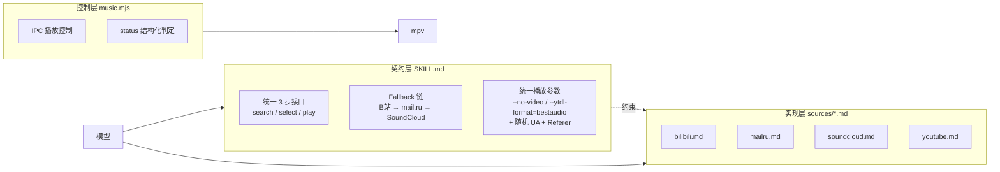
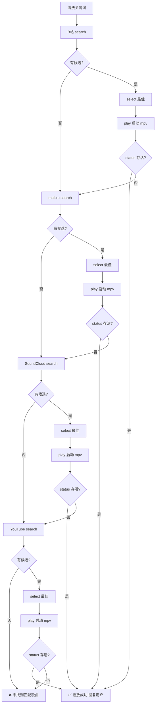
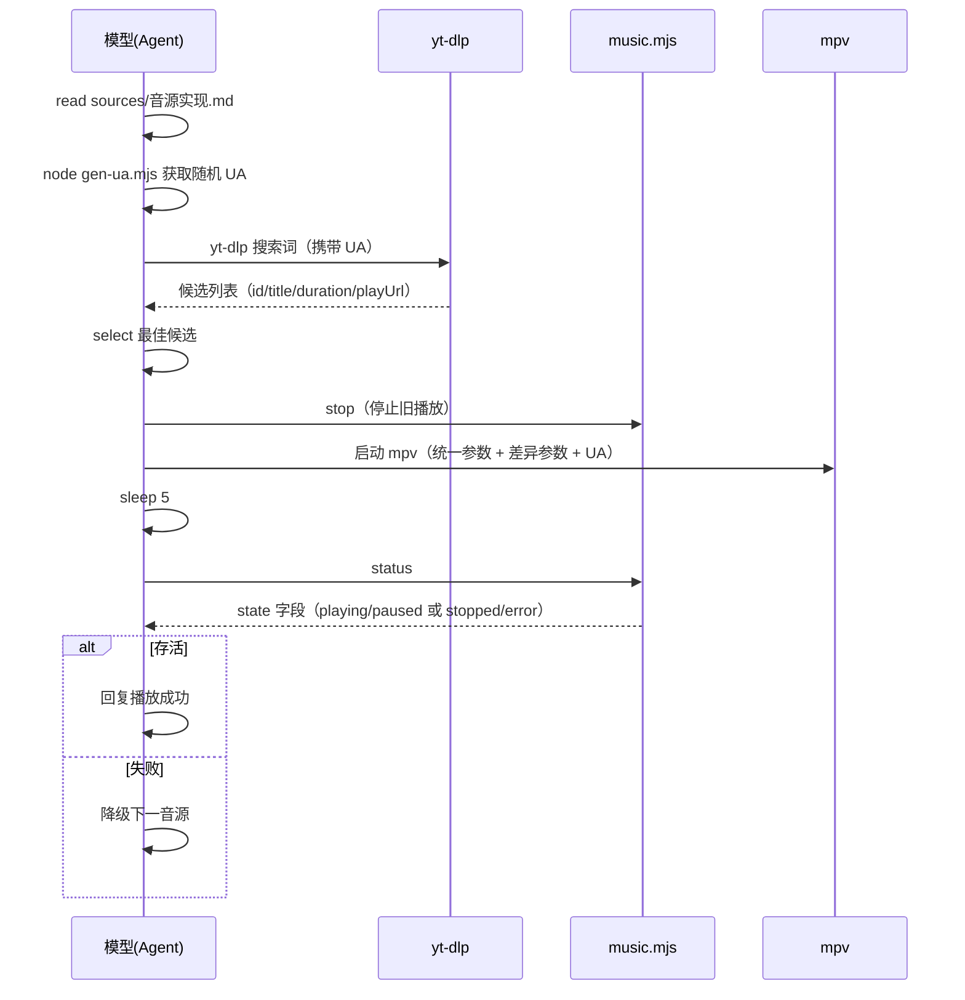

# Music Player Skill

在线音乐播放和播放控制技能。模型直接调用 yt-dlp 和 mpv CLI，music.mjs 仅用于播放控制。多音源（B站 / mail.ru / SoundCloud）按固定 fallback 顺序播放，YouTube 预留插槽。

**支持平台**：Git Bash (Windows)、Linux、macOS。不支持 PowerShell。

## 依赖检查（首次使用）

在首次使用前，在终端尝试运行以下命令。如果提示"找不到命令"，则说明未安装：

```bash
yt-dlp --version
mpv --version
```

如果缺少依赖，提示用户安装：
- **yt-dlp**: https://github.com/yt-dlp/yt-dlp#installation
- **mpv**: https://mpv.io/installation/

## 意图识别与处理

| 意图 | 判断依据 | 处理流程 |
|-----|---------|---------|
| 明确搜索 | 含歌曲名、艺人、心情、场景、曲风等 | 清洗输入 → 多态接口（搜索 → 选择 → 播放） |
| 需要澄清 | 只说"放点歌""来首音乐"，没有具体偏好 | 先问 1-2 个问题 |
| 播放控制 | 暂停、继续、下一首、音量等 | 调用 music.mjs |

**澄清优先级**：先问心情或场景 → 再问偏中文还是英文 → 不问播放器、脚本等技术细节。

推荐澄清句：`想听什么心情或场景的？偏中文还是英文？`

## 输入清洗

搜索前，模型先将用户输入清洗并构造为干净的搜索词：去除命令词（播放/play/来点等）、标点和多余空格，必要时补全艺人信息。

## 多态接口契约（核心）

### 架构



三层结构：**契约层**（SKILL.md，统一接口与参数）→ **实现层**（sources/*.md，每音源一个适配文件）→ **控制层**（music.mjs，IPC 控制与状态判定）。

### 统一接口定义

每个音源实现同一套 3 步接口，参数/返回由契约统一：

1. **search(keyword)**：给定清洗后的关键词，返回候选列表（含 id / 标题 / 时长 / 播放URL）。
2. **select(candidates)**：选择最佳候选（标题匹配 + 时长 120-420s + 优先原唱/官方版本）。
3. **play(playUrl)**：`music.mjs stop` → 启动 mpv（统一参数固定）→ `sleep 5` 后 `music.mjs status` 验证存活。

### Fallback 链（固定顺序）

```
B站 → mail.ru → SoundCloud → YouTube
  └ 失败则降级下一源（无结果 / yt-dlp 报错 / mpv 启动后退出）
全失败 → 回复"未找到匹配歌曲"，建议更具体的关键词
```



### 多态执行规则

- 模型必须先 `read sources/<音源>.md` 读取对应实现，再按其模板执行；**不得跨文件混用命令**。
- 每个音源独立完成「搜索 → 选择 → 播放 → 验证」四步，失败才降级下一源。

### 统一播放参数（契约固定，所有音源无条件添加）

本技能定位是**听歌**（非看视频），以下参数对所有音源无条件固定加，与音源无关：

| 参数 | 作用 |
|------|------|
| `--no-video` | 只播放音频，不渲染视频画面 |
| `--ytdl-format=bestaudio` | 优先选最佳音质音频流（mail.ru 直链不经 yt-dlp，参数被忽略，无害） |
| `--input-ipc-server=<pipe>` | IPC 控制必需（music.mjs 依赖） |

> 各音源实现文件（sources/*.md）的 play 模板里**不再重复列**这三个参数，只写差异化参数。

### 防风控统一参数（所有音源一律携带）

- **随机 UA**：每次执行 `node <skill-dir>/scripts/dist/gen-ua.mjs` 生成随机桌面 UA，加在每次 yt-dlp 搜索和 mpv 播放命令中。**不使用硬编码 UA 池。**
- **Referer 统一必加**：

| 音源 | Referer | 传参位置 |
|------|---------|---------|
| B站 | `https://www.bilibili.com/` | mpv `--ytdl-raw-options=add-header=Referer:...`（经 yt-dlp） |
| SoundCloud | `https://soundcloud.com/` | mpv `--ytdl-raw-options=add-header=Referer:...`（经 yt-dlp） |
| mail.ru | `https://my.mail.ru/` | mpv `--http-header-fields="Referer: https://my.mail.ru/"`（直链不经 yt-dlp） |
| YouTube | `https://www.youtube.com/` | mpv `--ytdl-raw-options=add-header=Referer:...`（经 yt-dlp） |

> **参数分层总结**：`--no-video --ytdl-format=bestaudio --input-ipc-server` + 随机 UA + 对应 Referer = **契约统一固定**；各源实现文件只写「搜索命令 + 播放 URL + 差异化边界」。

### 随机 UA 生成

每次搜索/播放前执行：

```bash
node <skill-dir>/scripts/dist/gen-ua.mjs
```

输出一个随机桌面端浏览器 UA（如 `Mozilla/5.0 (Windows NT 10.0; Win64; x64) ...Chrome/126.0.0.0 Safari/537.36`），再将其拼入 yt-dlp / mpv 命令。生成方式为运行时随机，无需维护 UA 池。

### 播放验证机制（结构化 status）

mpv 启动后 `sleep 5`，调用 `node <skill-dir>/scripts/dist/music.mjs status`，解析结构化 JSON。**单一 `state` 字段，值域固定 4 态，无冗余**：

| state | 含义 | 判定 |
|-------|------|------|
| `playing` | 播放中（存活） | ✅ 成功 |
| `paused` | 已暂停（存活） | ✅ 成功 |
| `stopped` | 未运行 | ❌ 失败，fallback |
| `error` | IPC/内部异常 | ❌ 失败，fallback |

**播放中 / 已暂停**（mpv 存活）：
```json
{ "state": "playing", "pid": 25116, "title": "心之火", "duration": 293, "position": 12.3, "volume": 80 }
{ "state": "paused", "pid": 25116, "title": "心之火", "duration": 293, "position": 45.1, "volume": 80 }
```

**未运行**：
```json
{ "state": "stopped" }
```

**异常**：
```json
{ "state": "error", "code": "IPC_TIMEOUT", "message": "..." }
```

**判定规则**（只判一个字段，无歧义）：
- `state === "playing"` 或 `state === "paused"` → 播放成功，回复用户
- `state === "stopped"` → 判定失败，fallback 下一源
- `state === "error"` → 判定失败（异常），fallback 下一源

### Fallback 流程伪代码

```
for 音源 in [B站, mail.ru, SoundCloud, YouTube]:
    实现 = read("sources/<音源>.md")          # 加载对应实现
    UA = node <skill-dir>/scripts/dist/gen-ua.mjs
    candidates = 实现.search(keyword, UA)     # 按实现模板执行
    if candidates 为空: continue
    best = 实现.select(candidates)
    实现.play(best.playUrl, UA)               # stop + mpv + status 验证
    if 播放存活: 回复成功并 return
    否则记录失败原因, continue
回复未找到，建议更具体的关键词
```

### 播放时序



## 各音源实现

每个音源一个实现文件，播放命令由「契约统一参数 + 各源差异化参数」拼接而成：

- `sources/bilibili.md` — B站（中文曲极全）
- `sources/mailru.md` — mail.ru（英文曲直链）
- `sources/soundcloud.md` — SoundCloud（独立音乐/翻唱）
- `sources/youtube.md` — YouTube（默认无 cookie，英文曲极全）

**执行流程**：先 `read` 上方 SKILL.md 契约取统一参数，再 `read sources/<音源>.md` 取差异化参数，拼接成完整命令。

**音源支持度参考**（帮助判断候选匹配度）：

| 音源 | 中文曲 | 英文曲 | 风控级别 |
|------|--------|--------|---------|
| **B站** | 极全（华语流行/OST/翻唱） | 少（官方MV/搬运） | 低-中（搜索偶发 412，需 UA+Referer） |
| **mail.ru** | 几乎无 | 有一些（欧美主流歌手） | 低（无需登录，直链即得） |
| **SoundCloud** | 很少 | 好（独立音乐人/翻唱/remix） | 中（需完整 URL，偶发 DRM） |
| **YouTube** | 好 | 极全 | 中-高（搜索无 cookie；播放偶发 bot 检测） |

## 播放控制

所有控制命令通过 `music.mjs` 调用（播放命令详见 sources/ 下对应音源文件）：

```bash
node <skill-dir>/scripts/dist/music.mjs <command>
```

| 用户输入 | 命令 | 说明 |
|---------|------|------|
| `播放 歌曲名`、`play 歌曲名`、`我想听 歌曲名` | - | 清洗 → 多态接口（搜索 → 选择 → 播放） |
| `暂停`、`pause` | `pause` | 暂停播放 |
| `继续播放`、`resume` | `resume` | 恢复播放 |
| `下一首`、`next` | `next` | 下一首 |
| `上一首`、`prev` | `prev` | 上一首 |
| `声音大一点`、`volume up` | `volume-up` | 音量 +10 |
| `声音小一点`、`volume down` | `volume-down` | 音量 -10 |
| `静音`、`mute` | `mute` | 切换静音 |
| `单曲循环`、`loop` | `loop` | 开启单曲循环 |
| `关闭循环`、`loop-off` | `loop-off` | 关闭单曲循环 |
| `退出音乐`、`停止播放`、`stop` | `stop` | 停止播放并退出 |
| `播放状态`、`status` | `status` | 查看播放状态（结构化 JSON） |

**输出格式**：控制命令输出 JSON；status 输出结构化 JSON（见「播放验证机制」）。

```json
{ "status": "success", "action": "pause" }
{ "state": "stopped" }
{ "error": "mpv not running" }
```

## 回复要求（必须）

1. **播放成功**：转述歌曲信息（`正在播放：Numb - Linkin Park`）+ 1 段 2-4 句歌曲简介
2. **播放失败**（全部音源失败）：告知 `未找到匹配的歌曲`，建议 `可以尝试更具体的歌曲名或艺人名`
3. **控制命令**：简洁确认（`已暂停`、`已继续播放`、`已切换到下一首`）
